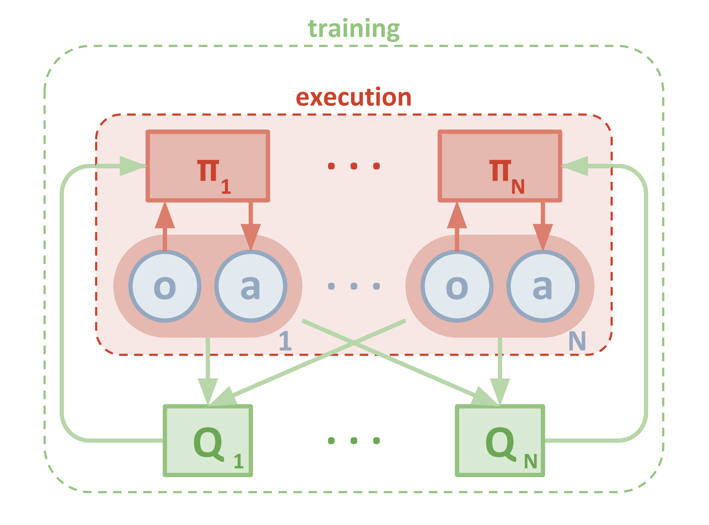
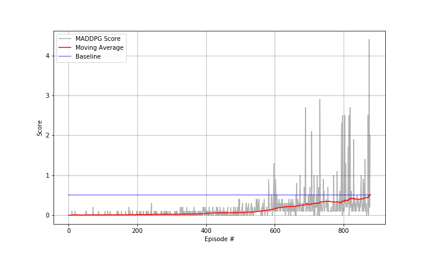

# Project Report

## Learning Algorithm

To solve this project `Multi Agent Deep Deterministic Policy Gradient` algorithm was used. The details of the algorithm can be found in the paper given by OpenAI: [Multi-Agent Actor-Critic for Mixed
Cooperative-Competitive Environments](https://arxiv.org/pdf/1706.02275)

The network diagram of MADDPG is as follows:



The network shows two different Actors (Multi-agents) and a single Critic.
MADDPG is a **policy-based method** which are well suited for continuous action spaces such as our `Tennis` environment and can learn stochastic policies.

In contrast to DDPG instead of training each agent to learn from its own actions, MADDPG incorporates actions taken by all the agents. The environment state depends on the actions taken by all agents (collaboration of the tennis players to maximize rewards) so if we train an agent using just its own action the policy network does not get enough information to come up with a good policy. MADDPG improves upon DDPG by sharing the actions taken by all agents to train each agent.

**Actor-Critic Method**

Actor-critic methods leverage the strengths of both policy and value based methods.

The Actor uses a policy-based approach and learns how to act by directly estimating the optimal policy and maximizing reward through gradient ascent. Critic uses a value-based approach and learns how to estimate the value, the future cumulative reward, of different state-action pairs. Actor-critic agents are more stable than value-based agents, while requiring fewer training samples than policy-based agents and accelerates the learning process.

### Hyperparameters

The hyper-parameters used for the Agent model are:

```
BUFFER_SIZE = int(1e6)  # replay buffer size
BATCH_SIZE = 128        # minibatch size
LR_ACTOR = 1e-3         # learning rate of the actor
LR_CRITIC = 1e-3        # learning rate of the critic
WEIGHT_DECAY = 0        # L2 weight decay
LEARN_EVERY = 10        # learning timestep interval
LEARN_NUM = 5           # number of learning passes
GAMMA = 0.99            # discount factor
TAU = 8e-3              # for soft update of target parameters
OU_SIGMA = 0.2          # Ornstein-Uhlenbeck noise parameter, volatility
OU_THETA = 0.15         # Ornstein-Uhlenbeck noise parameter, speed of mean reversion
EPS_START = 5.0         # initial value for epsilon in noise decay process in Agent.act()
EPS_EP_END = 300        # episode to end the noise decay process
EPS_FINAL = 0           # final value for epsilon after decay
```

### Model Architecture

The model for the Actor_Network is as follows:

```
(fc1) = nn.Linear(48, 256)
(fc2) = nn.Linear(256, 128)
(fc3) = nn.Linear(128, 2)
```
where (fc1) and (fc2) are followed by ReLU and (fc3) is followed by Tanh activation functions.

The model for the Critic_Network is as follows:

```
(fcs1) = nn.Linear(48, 256)
(fc2) = nn.Linear(256+4, 126)
(fc3) = nn.Linear(126, 1)
```
where (fcs1) and (fc2) are followed by ReLU activation function.

## Plot of Rewards

The Agent was able to achieve the goal in 359 episodes. Following is the plot of scores corresponding to each episode:



## Future Work

* Apply following algorithms to compare with MADDPG: 
  - PPO
  - A3C
  - D4PG
* Vary the hyper parameters, and compare the performance.